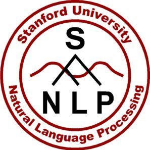

# SWIFT
SWIFT provides faster, inexpensive support for employees. The application uses NER (Named-Entity Recognition) to extract relevant details from employee messages and forwards them to the appropriate department or party which can handle the issue.

# Abstract
Employee productivity and satisfaction are absolutely essential to businesses. If employees are unable to quickly get support on problems they have, frustrations rise, output drops, and a business's sales will suffer in the long run. In a large company with many employees spread across departments with different responsibilities, it takes time to forward an issue to someone who can address it. A support team may handle an employee support channel in an online workspace, such as Slack. The team must read through all employee messages, decide who to send each message to, and coordinate further actions between the people involved. Much cost and effort is spent to do this.

SWIFT is a Slack plug-in application which will automate the process of sending employee messages to the right people. It looks at individual messages in a Slack support channel and routes the problem to the right people. The app also has a dashboard that can pull stats to help guide the support team's planning and taking proactive actions.

# Target Users
Employees of a medium-sized company with a Slack workspace. The company has departments providing different services, such as health, finance, and technician support.

# Hill Statement
Who-
Any employee that needs to report any issue to the specific department in the organization.

What-
A slack plug-in application that automates the process of sending messages or reporting issues to the relavent department in the organization.

Wow Factor-
It assures the whole process of sending messages to the appropriate department to be fast,
flexible and accurate, so that the problem is fixed as early as possible.

# Architecture Diagram

# Technology Stack
Node JS, Express JS, Slack API, Stanford NER tagger.

